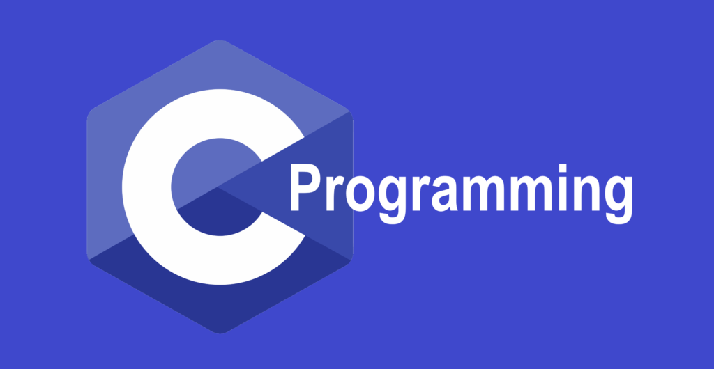

# Table of Contents

1.  [Who is your lecturer?](#orgbcdad92)
2.  [My first programming languages](#orgafd3e71)
3.  [The importance of infrastructure](#org7dfd949)
4.  [What do you expect from this course?](#org90954b5)
5.  [What careers do our students have?](#org519e568)
6.  [What will you do in this course?](#orge9d1137)
7.  [GCC installation on MacOS](#org03239ba)
8.  [How will you be evaluated?](#org035e67c)
9.  [Which tools are you going to use?](#org9524da3)
10. [The (new) Canvas LMS](#org17cca38)
11. [The (popular) GitHub platform](#org29312eb)
12. [The (feared) Emacs editor](#orgb44e5fb)
13. [Practice: first "literate" C program!](#orgeef3b68)
14. [When is the first assignment due?](#org52fbd12)
15. [What are you looking forward to?](#org200801c)
16. [Next](#org4b3357e)
17. [Glossary](#orgb7ec60d)
18. [References](#orga709892)

# Who is your lecturer?

-   Not cats OR dogs, but [cats AND dogs](https://drive.google.com/file/d/1z-0cbqfXPA_6HMgIxb043CN5qCUJLEYz/view?usp=sharing)
-   Physicist by training ([making sense of this](https://images.nature.com/original/magazine-assets/d41586-022-01388-6/d41586-022-01388-6_20499086.jpg))
-   Teacher by profession ([making sense of this](https://m.media-amazon.com/images/I/91UJz-ti6BL.jpg))
-   Data scientist by choice ([making sense of this](https://media.wired.com/photos/601c6246898afb612573ad4c/master/w_960,c_limit/BLACK%20SUN%20#34.jpg))
-   Lyon College since 2021 ([from Berlin, Germany](https://www.visitberlin.de/system/files/styles/visitberlin_hero_visitberlin_desktop_2x/private/image/eberswalderstrasse26_c_visitBerlin_Foto_Dagmar_Schwelle_web.jpg?h=1c9b88c9&itok=xMVdiKwM))

# My first programming languages

-   My first programming languages:
    1.  BASIC - Beginner's All-purpose Symbolic Instruction Code (1979)
    2.  FORTRAN - FORMula TRANslator (1985)
    3.  C++ (1989)

-   [X] How many programming languages are there today?

# The importance of infrastructure

The image shows eight layers that your computing infrastructure has to
manage (there are more in fact) - most of the software enabling you to
do this (without you noticing) is written in C.

# What do you expect from this course?

-   I would like to make a website
-   I want to learn as many languages as I can
-   I may need it (formally) for my Math major
-   I want to make video games
-   I want to get better at computing because of math/eng
-   I want to become a software developer
-   I want to see if computing may be in my future

# What careers do our students have?

# What will you do in this course?

 or GitHub (github.com/birkenkrahe/ds2)")

-   We have a **textbook** - King, C Programming - A modern approach (2008)
-   We have an **operating system** - Linux (maybe) or Windows/MacOS
-   We have (more than) an **editor** - Emacs + Org-mode
-   We have a **compiler** - GCC ([also on a Mac](https://raw.githubusercontent.com/birkenkrahe/cc/piHome/img/0_gcc_mac.png))

# GCC installation on MacOS

The following two answers came from ChatGPT, a conversational machine
learning model created by OpenAI.

# How will you be evaluated?

 or GitHub (github.com/birkenkrahe/ml)")

-   All course requirements have deadlines
-   Late submissions will be penalized (loss of points)
-   Final exam will be sourced by term test questions
-   Programming assignments are home assignments
-   In-class practices are "literate programming" exercises

# Which tools are you going to use?

-   [Canvas](https://lyon.instructure.com/) (learning management system)

-   [GitHub repository](https://github.com/birkenkrahe/cc) (all course materials except tests)

-   [GNU Emacs](https://github.com/birkenkrahe/org/blob/master/FAQ.org) (literate programming environment)

-   [Command line interface](https://en.wikipedia.org/wiki/Command-line_interface) / interpreter - (shell / replit.com)<a id="fnr.1" class="footref" href="#fn.1" role="doc-backlink">1</a>

# The (new) Canvas LMS

-   Announcements
-   Assignments (Programming assignments and in-class practice)
-   Zoom links (participate/cloud recording)
-   Course links (GitHub, Whiteboard)
-   Gradebook

# The (popular) GitHub platform

")

-   [GitHub](https://github.com/birkenkrahe) is the most popular software development platform.

-   It's now owned by Microsoft (which is becoming a problem)

-   Here for you: all course materials, and the course FAQ

# The (feared) Emacs editor

# DONE Practice: first "literate" C program!

(You can find a [PDF of this exercise](https://github.com/birkenkrahe/cc/blob/piHome/pdf/first_org_print.pdf) on GitHub)

Let's set Emacs up, write and run a first "literate" C program!

1.  Open the command line terminal with `CMD` in the search field

2.  At the prompt, type `gcc --version`

3.  Open <https://github.com/birkenkrahe/org/> in a browser

4.  Navigate to the repository `emacs` in GitHub

5.  Click on the file name `.emacs` to open it

6.  Open the `Raw` version of this file (there's a button)

7.  Right click to `Save as` and save file as `emacs.txt` in `/Downloads`

8.  Open a terminal by entering `CMD` in the Windows search bar

9.  Pin the terminal to your taskbar

10. At the prompt, enter `DIR emacs.txt` - you should see the file

11. At the prompt, enter `emacs --version`

12. Enter `emacs -nw -l emacs.txt`

13. Inside Emacs, click `<F10>` and `ENTER` to open a new file

14. At the prompt at the bottom of the screen, enter `first.org`

15. Enter the following text (replace `yourname` with your own name):
    
    

16. Run the program by putting the cursor anywhere on the code block
    and typing `CTRL-c CTRL-c` (or `C-c C-c`)

17. Tangle the code with `C-c C-v t` (or `M-x org-babel-tangle`)
    
    

18. Open a shell (terminal program) with `ALT-x eshell`

19. At the prompt, enter `ls -l first*` - you should see `first.C`

20. Enter `gcc first.C -o hello`

21. Enter `hello` to run the program.

22. Upload `first.org` as your first in-class assignment [to Canvas!](https://lyon.instructure.com/courses/1041/assignments/5889)

# When is the first assignment due?

")

-   The first in-class assignment (`first.org`, see Canvas) is due on
    Friday, January 27. For late submissions, you lose 1 point per day
    (out of 10 possible points)

-   The first home assignment (`Emacs tutorial`, see Canvas) is due on
    Monday, January 27. For late submissions, you lose 1 point per day
    (out of 10 possible points)

-   We'll write the first weekly multiple-choice test on January 23,
    covering all of the material that was covered until then.

# What are you looking forward to?

# Next

# Glossary

<table border="2" cellspacing="0" cellpadding="6" rules="groups" frame="hsides">

<colgroup>
<col  class="org-left" />

<col  class="org-left" />
</colgroup>
<thead>
<tr>
<th scope="col" class="org-left">TERM</th>
<th scope="col" class="org-left">MEANING</th>
</tr>
</thead>

<tbody>
<tr>
<td class="org-left">Meta data</td>
<td class="org-left">Data about data (e.g. layout instructions)</td>
</tr>

<tr>
<td class="org-left">Infrastructure</td>
<td class="org-left">Computing roadworks: hardware and software</td>
</tr>

<tr>
<td class="org-left">Editor</td>
<td class="org-left">Program to write programs in</td>
</tr>

<tr>
<td class="org-left">Compiler</td>
<td class="org-left">Program to turn source into machine code</td>
</tr>

<tr>
<td class="org-left"><code>gcc</code></td>
<td class="org-left">The GNU C compiler</td>
</tr>

<tr>
<td class="org-left">Source code</td>
<td class="org-left">Code for humans to read and edit (<code>.c</code>)</td>
</tr>

<tr>
<td class="org-left">Machine code</td>
<td class="org-left">Code for machines to execute (<code>.exe</code>)</td>
</tr>

<tr>
<td class="org-left"><a href="https://en.wikipedia.org/wiki/Git">Git</a></td>
<td class="org-left">Software version control system (2005)</td>
</tr>

<tr>
<td class="org-left"><a href="https://www.gnu.org/software/emacs/">Emacs</a></td>
<td class="org-left">Extensible editor written in Lisp (1985)</td>
</tr>

<tr>
<td class="org-left">FOSS</td>
<td class="org-left">Free and Open Source Software</td>
</tr>

<tr>
<td class="org-left"><a href="https://en.wikipedia.org/wiki/Linux">Linux</a></td>
<td class="org-left">FOSS operating system (1991)</td>
</tr>

<tr>
<td class="org-left">Windows, MacOS</td>
<td class="org-left">Commercial OS (Microsoft, Apple)</td>
</tr>

<tr>
<td class="org-left">Android</td>
<td class="org-left">Linux for smartphones (Google)</td>
</tr>

<tr>
<td class="org-left">iOS</td>
<td class="org-left">MacOS for Apple smartphones</td>
</tr>

<tr>
<td class="org-left">Command line</td>
<td class="org-left">Terminal, shell program to talk to the OS</td>
</tr>

<tr>
<td class="org-left">Prompt</td>
<td class="org-left">Location on your computer, e.g. <code>C:\User\</code></td>
</tr>

<tr>
<td class="org-left">Raw file</td>
<td class="org-left">No control characters for syntax highlighting</td>
</tr>

<tr>
<td class="org-left">Syntax highlighting</td>
<td class="org-left">Making programming language visible</td>
</tr>

<tr>
<td class="org-left"><code>DIR</code></td>
<td class="org-left">Windows command to list files</td>
</tr>

<tr>
<td class="org-left"><code>cd</code></td>
<td class="org-left">Command to change directory</td>
</tr>

<tr>
<td class="org-left">Literate pgm</td>
<td class="org-left">Doc + code + output for humans and machines</td>
</tr>

<tr>
<td class="org-left">Org-mode</td>
<td class="org-left">Plugin for Emacs to edit Org files (<code>.org</code>)</td>
</tr>

<tr>
<td class="org-left">Dunning-Kruger effect</td>
<td class="org-left">Illustrating ignorance of your own ignorance</td>
</tr>
</tbody>
</table>

# References

-   King K N (2008). C Programming - A Modern Approach. Norton.

# Footnotes

<a id="fn.1" href="#fnr.1">1</a> A command line prompt is the place in the CLI where you type
commands for the computer. It typically includes text that indicates a
location on your computer, e.g. `c:/Users/birkenkrahe>`
