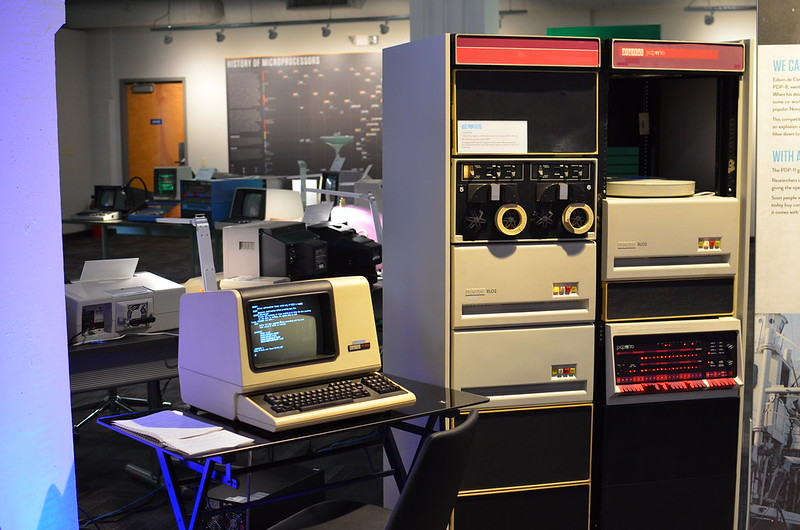
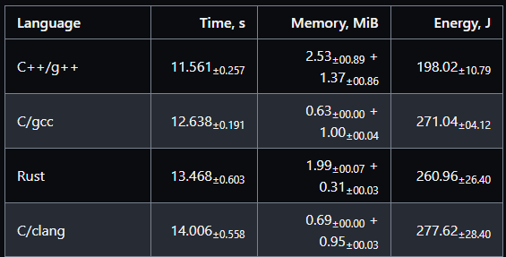
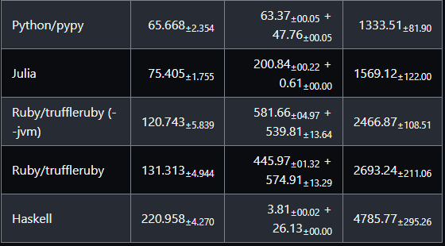

# Table of Contents

1.  [What will you learn?](#orgcf948bc)
2.  [What is C?](#org529fe63)
3.  [How popular is C?](#org8bf5972)
4.  [How important is C?](#org568aa79)
5.  [What is a programming language?](#org5dc60c2)
6.  [Where does C come from?](#orgf601ad2)
7.  [Standardization](#orgd917dde)
8.  [How computers work](#org893e47e)
9.  [How programs are processed](#org1baac23)
10. [Looks matter](#orgadcc016)
11. [The Latin of programming languages](#orga9d15b7)
12. [Benchmarking](#orgf89ada6)
13. [Strengths and weaknesses of C](#org6c69d71)
14. [What is the difference between C and C++?](#orgc299935)
15. [Why are we not just learning C++?](#org966d069)
16. [Why am I teaching C/C++?](#org5dd1f1a)
17. [What will happen to C/C++ in the next 20 years?](#org6ffa23d)
18. [Summary](#org1f37b0b)
19. [Glossary](#org8a9e274)
20. [What's next?](#orgcd31f03)
21. [References](#orgcb7f935)

# What will you learn?

-   What is C?
-   What is its origin?
-   What is its importance?
-   What's the difference to C++?
-   Why are we not just learning C++?
-   What are C's strengths and weaknesses?
-   Why are you learning C from me?
-   What's next in the course?

Source:

-   Textbook King (2008) ch.1<a id="fnr.1" class="footref" href="#fn.1" role="doc-backlink">1</a>
-   See also [slides (GDrive)](https://docs.google.com/presentation/d/16jVt1LYw_an7na_Ex0bz8l2uySJtydBK/edit?usp=sharing&ouid=102963037093118135110&rtpof=true&sd=true)

# What is C?

-   C is a programming language created in the early 1970s.
-   It grew out of the development of the UNIX operating system
-   In turn, UNIX grew out of a space travel game (Brock, 2019).

")

# How popular is C?

-   C consistently ranks among the top 3 programming languages.
-   TIOBE Language of the year 2008, 2017, 2019

")

-   Popularity contest: cp. [TIOBE Index](https://www.tiobe.com/tiobe-index/)<a id="fnr.2" class="footref" href="#fn.2" role="doc-backlink">2</a>

\_")+

-   Of the top 10 languages, 7 are direct descendants of C - only Visual
    Basic, SQL and Assembly language are not C-type languages

")

# How important is C?

")

Some well-known programs written in C:

-   The Linux kernel (and therefore, Android)
-   UNIX operating system (core of MacOS)
-   Windows 1.0 to Windows XP
-   Doom (early video game)
-   Wolfenstein 3D
-   Git version control system
-   C compilers (Clang, GCC/MinGW)
-   Any software that crosses platforms easily (portable)

See also: "[Why C programming is awesome](https://youtu.be/smGalmxPVYc)" (Hawkes, 2016).

# What is a programming language?

> "A programming language is a *formal language* comprising of a set of
> *strings* that produce various kinds of *machine code*
> output. Programming languages are one kind of computer language, and
> are used in computer programming to implement algorithms." (Source:
> [Wikipedia](https://en.wikipedia.org/wiki/Programming_language))

-   **Formal** language?
-   Set of **strings**?
-   **Machine** code?
-   **Algorithm**?

Fortunately, computer (and data) science isn't really a science at all!

(it's more of a craft like mining, knitting, or pottering.)

")

# Where does C come from?

")

-   By-product of the UNIX operating system 1969 <a id="fnr.3" class="footref" href="#fn.3" role="doc-backlink">3</a>
-   Developed on DEC PDP-7 (computer with 8K words of main memory)
-   Written originally in assembly language
-   UNIX rewritten in C by 1973 for [DEC PDP-11](https://en.wikipedia.org/wiki/PDP-11)
-   Standardization of C, 1973-2018

> **Challenge:** what does "8K words of main memory" mean? <a id="fnr.4" class="footref" href="#fn.4" role="doc-backlink">4</a>

See also: [C Programming Language | Brian Kernighan & Lex Fridman](https://youtu.be/G1-wse8nsxY)

-   Text processing problems were inherited from Unix
-   Examples should be realistic, useful and representative
-   If you're the first in anything, everybody else has to follow

# Standardization

")

Details: see [ANSI](https://blog.ansi.org/2018/11/c-language-standard-iso-iec-9899-2018-c18/#gref) (American National Standards Institute)

Python 3 was not "backwards compatible" with Python 2.7

# How computers work

Well, at least this is one way of looking at it.

")

The "hard disk" can also be a Solid State Drive (SSD) or some other
form of Non-Volatile Memory (NVM) - i.e. it doesn't disappear when
the power goes out.

# How programs are processed

## Simplified process

1.  **WRITE** source code in an editor (NVM = harddisk)
2.  **COMPILE** source code to machine code (RAM = memory)
3.  **RUN** program (CPU = Central Processing Unit)
4.  **DISPLAY** results (RAM = Memory)
5.  **SAVE** result (NVM = harddisk)

## Complete process

Specifically for C and our compiler GCC, this process looks
technically like this:

.")

# Looks matter

She's a beauty.

<table border="2" cellspacing="0" cellpadding="6" rules="groups" frame="hsides">

<colgroup>
<col  class="org-left" />
</colgroup>
<tbody>
<tr>
<td class="org-left">Challenge: was C the first programming language? <a id="fnr.5" class="footref" href="#fn.5" role="doc-backlink">5</a></td>
</tr>
</tbody>
</table>

# The Latin of programming languages

The following languages are C-based:

-   C++ (OOP extension of C, games)
-   Java (OOP, VM-portable, and no pointers)
-   C# (Microsoft, games)
-   Perl (scripting, text mining)

> "C is to programming languages what Latin is to Western natural
> languages." (Anonymous)

-   C is lightning fast and terribly tiny
    
    > "C is fast because it's the speed of light, and relativity?"<a id="fnr.6" class="footref" href="#fn.6" role="doc-backlink">6</a>
    > ([Stackoverflow](https://stackoverflow.com/questions/418914/why-is-c-so-fast-and-why-arent-other-languages-as-fast-or-faster))

# Benchmarking

-   Excerpts for parsing and printing a *Mandelbrot* set
-   *Benchmarks* depend on algorithm implementation
-   C always wins the size battle (*memory allocation*)
-   Some very *specialized* languages are even faster

# Strengths and weaknesses of C

<table border="2" cellspacing="0" cellpadding="6" rules="groups" frame="hsides">

<colgroup>
<col  class="org-left" />

<col  class="org-left" />
</colgroup>
<thead>
<tr>
<th scope="col" class="org-left">STRENGTH</th>
<th scope="col" class="org-left">WEAKNESS</th>
</tr>
</thead>

<tbody>
<tr>
<td class="org-left">Efficiency</td>
<td class="org-left">Permissiveness (Error-prone)</td>
</tr>

<tr>
<td class="org-left">Portability</td>
<td class="org-left">Terseness and Understanding</td>
</tr>

<tr>
<td class="org-left">Power</td>
<td class="org-left">Large program maintenance</td>
</tr>

<tr>
<td class="org-left">Flexibility</td>
<td class="org-left">&#xa0;</td>
</tr>

<tr>
<td class="org-left">Standard library</td>
<td class="org-left">&#xa0;</td>
</tr>

<tr>
<td class="org-left">Integration with UNIX</td>
<td class="org-left">&#xa0;</td>
</tr>
</tbody>
</table>

-   Efficiency: do a lot with little effort (small programs)
-   Portability: it works everywhere, on anything
-   "Power": you can do brain surgery with a pencil
-   Flexbility: you can do the same thing in many different ways
-   "Standard library": pre-defined functions/tasks; "stdio.h", a
    standard library for "I/O" (Input/output)
-   Integration with UNIX (because UNIX is the motherlobe)

# What is the difference between C and C++?

C++ is a superset of C.

<table border="2" cellspacing="0" cellpadding="6" rules="groups" frame="hsides">

<colgroup>
<col  class="org-left" />

<col  class="org-left" />

<col  class="org-left" />
</colgroup>
<thead>
<tr>
<th scope="col" class="org-left">WHAT</th>
<th scope="col" class="org-left">C</th>
<th scope="col" class="org-left">C++</th>
</tr>
</thead>

<tbody>
<tr>
<td class="org-left">TIME</td>
<td class="org-left">Thompson/Ritchie 1970s</td>
<td class="org-left">Stroustrup 1980s</td>
</tr>

<tr>
<td class="org-left">TYPE</td>
<td class="org-left">Imperative procedural</td>
<td class="org-left">Object-oriented</td>
</tr>

<tr>
<td class="org-left">GOOD</td>
<td class="org-left">System programming</td>
<td class="org-left">Games and graphics</td>
</tr>

<tr>
<td class="org-left">USED</td>
<td class="org-left">Internet of Things</td>
<td class="org-left">Flight Software</td>
</tr>
</tbody>
</table>

Source: Lemonaki, 2021.

# Why are we not just learning C++?

-   Object-orientation is a difficult paradigm (C++)
-   System programming is pure power (C)
-   C is simpler, smaller, and faster

")

-   Bjarne Stroustrup (2011): "[C is obsolete](https://youtu.be/KlPC3O1DVcg)"<a id="fnr.7" class="footref" href="#fn.7" role="doc-backlink">7</a>
-   Linus Torvalds (2007): "[C++ is a horrible language](http://harmful.cat-v.org/software/c++/linus)"<a id="fnr.8" class="footref" href="#fn.8" role="doc-backlink">8</a>.
    
    Also, there's this:
    
    > "Languages are tools. Memorizing them no more makes you a computer
    > scientist than studying hammers makes you a carpenter." -[Neilsen](https://qr.ae/pGzZ9z)
    
    -   It's easy to pick up additional languages
    -   Data structures and algorithms are key to understanding
    -   First language could be anything<a id="fnr.9" class="footref" href="#fn.9" role="doc-backlink">9</a>

# Why am I teaching C/C++?

It's personal.

")

> I used C++ during my PhD studies at DESY, Germany, to write a
> library of multigrid functions (numerical method for lattice gauge
> theory simulations in theoretical particle physics).<a id="fnr.10" class="footref" href="#fn.10" role="doc-backlink">10</a>

# What will happen to C/C++ in the next 20 years?

Whatever happens, good new for learning C.

")

I increasingly see propaganda for [replacing C++ by Rust](https://www.incredibuild.com/blog/rust-vs-c-and-is-it-good-for-enterprise) (Kirsh, 2021),
another relatively new language with OOP support and better security
properties.

# Summary

1.  The C programming language was created 50 years ago
2.  C is small, simple, very fast, and close to the computer
3.  Linux (and Android) are largely written in C
4.  The object-oriented programming (OOP) language C++ contains C
5.  System programming is a powerful skill set

# Glossary

<table border="2" cellspacing="0" cellpadding="6" rules="groups" frame="hsides">

<colgroup>
<col  class="org-left" />

<col  class="org-left" />
</colgroup>
<thead>
<tr>
<th scope="col" class="org-left">CONCEPT/TOPIC</th>
<th scope="col" class="org-left">DEFINITION</th>
</tr>
</thead>

<tbody>
<tr>
<td class="org-left">DEC PDP-11</td>
<td class="org-left">1970s mainframe computer</td>
</tr>

<tr>
<td class="org-left">UNIX</td>
<td class="org-left">Operating system (ca. 1969)</td>
</tr>

<tr>
<td class="org-left">ANSI</td>
<td class="org-left">American National Standard Institute</td>
</tr>

<tr>
<td class="org-left">String</td>
<td class="org-left">A data type representing text</td>
</tr>

<tr>
<td class="org-left">Assembler</td>
<td class="org-left">Machine code (hard to write/read)</td>
</tr>

<tr>
<td class="org-left">Algorithm</td>
<td class="org-left">Fixed process or set of rules</td>
</tr>

<tr>
<td class="org-left">Linux</td>
<td class="org-left">Operating system (ca. 1991)</td>
</tr>

<tr>
<td class="org-left">C</td>
<td class="org-left">Imperative, procedural programming language</td>
</tr>

<tr>
<td class="org-left">compiler</td>
<td class="org-left">Software to translate source into machine code</td>
</tr>

<tr>
<td class="org-left">C++</td>
<td class="org-left">Object-oriented (OO) superset of C</td>
</tr>

<tr>
<td class="org-left">Clang</td>
<td class="org-left">C/C++ compiler</td>
</tr>

<tr>
<td class="org-left">gcc</td>
<td class="org-left">GNU compiler bundle (incl. C/C++)</td>
</tr>

<tr>
<td class="org-left">Java,C#</td>
<td class="org-left">OO programming language</td>
</tr>

<tr>
<td class="org-left">Perl</td>
<td class="org-left">Scripting language</td>
</tr>

<tr>
<td class="org-left">Git</td>
<td class="org-left">Software version control system</td>
</tr>

<tr>
<td class="org-left">GitHub</td>
<td class="org-left">Developer's platform (owned by Microsoft)</td>
</tr>

<tr>
<td class="org-left">Library</td>
<td class="org-left">Bundle of useful functions and routines</td>
</tr>

<tr>
<td class="org-left">Portability</td>
<td class="org-left">Ability of software to run on different hardwares</td>
</tr>

<tr>
<td class="org-left">Efficiency</td>
<td class="org-left">Software speed of execution and memory requirements</td>
</tr>

<tr>
<td class="org-left">Permissiveness</td>
<td class="org-left">Degree to which a language tolerates ambiguities</td>
</tr>

<tr>
<td class="org-left">Object-orientation</td>
<td class="org-left">Ability to define abstractions</td>
</tr>

<tr>
<td class="org-left">System programming</td>
<td class="org-left">Programming close to the machine</td>
</tr>

<tr>
<td class="org-left">Application programming</td>
<td class="org-left">Programming close to the user</td>
</tr>
</tbody>
</table>

# What's next?

-   Getting started: Infrastructure (Lab)
-   MinGW (compiler) + Emacs (editor) + GitHub (collaboration)
-   First program: "hello world" (Lecture + Lab)
    
    

# References

-   Big Think (Jun 13, 2011). Bjarne Stroustrup: Why the Programming
    Language C Is Obsolete | Big Think
    [video]. [URL:youtu.be/KlPC3O1DVcg](https://youtu.be/KlPC3O1DVcg).
-   Brock (October 17, 2019). The Earliest Unix Code: An Anniversary
    Source Code Release [Blog]. URL: [computerhistory.org](https://computerhistory.org/blog/the-earliest-unix-code-an-anniversary-source-code-release/).
-   Cass (6 Sept 2019). The Top Programming Languages 2019 > Python
    remains the big kahuna, but specialist languages hold their
    own. IEEE Spectrum. [URL: spectrum.ieee.org](https://spectrum.ieee.org/the-top-programming-languages-2019).
-   Chatley R., Donaldson A., Mycroft A. (2019) The Next 7000
    Programming Languages. In: Steffen B., Woeginger G. (eds) Computing
    and Software Science. Lecture Notes in Computer Science,
    vol 10000. Springer,
    Cham. <https://doi.org/10.1007/978-3-319-91908-9_15>
-   Data Flair (n.d.). Applications of C Programming That Will Make You
    Fall In Love With C [Tutorial]. URL: d[ata-flair.training.](https://data-flair.training/blogs/applications-of-c/)
-   DESY (Oct 25, 1995). The C++ Virtual Library. URL: [desy.de](https://www.desy.de/user/projects/C++.html)
-   Gustedt (2019). Modern C. Manning.
-   Hock-Chuan (2018). GCC and Make: Compiling, Linking and Building
    C/C++ Applications [website]. [URL: ntu.edu.sg](https://www3.ntu.edu.sg/home/ehchua/programming/cpp/gcc_make.html).
-   Kernighan/Ritchie (1978). The C Programming Language. Prentice
    Hall. [Online: wikipedia.org](https://en.wikipedia.org/wiki/The_C_Programming_Language).
-   King (2008). C Programming - A Modern Approach. Norton. [Online:knking.com](http://knking.com/books/c2/index.html).
-   Kirsh (September 13, 2021). Rust vs C++ and Is It Good for
    Enterprise? [blog]. [URL: www.incredibuild.com](https://www.incredibuild.com/blog/rust-vs-c-and-is-it-good-for-enterprise).
-   Lemonaki, Dionysia (November 4, 2021). C vs. C++ - What's The
    Difference [blog]. URL: [freecodecamp.org.](https://www.freecodecamp.org/news/c-vs-cpp-whats-the-difference/)
-   Neilsen (Aug 14, 2020). Quora. URL: [qr.ae/pGzZ9z](https://qr.ae/pGzZ9z).
-   Steinhart (2019). The Secret Life of Programs. NoStarch
    Press. [URL:nostarch.com.](https://nostarch.com/foundationsofcomp)
-   TIOBE (Jan 2022). TIOBE Index for January 2022
    [website]. [URL:tiobe.com](https://www.tiobe.com/tiobe-index/).
-   Torvalds (6 Sep 2007). Linus Torvalds on C++
    [blog]. [URL:harmful.cat-v.org](http://harmful.cat-v.org/software/c++/linus).
-   xkcd(n.d.) Purity [cartoon]. [URL: xkcd.com/](https://xkcd.com/435/).

# Footnotes

<a id="fn.1" href="#fnr.1">1</a> All sources are referenced at the end of the script, followed by
the footnotes, which do unfortunately not render as links [on
GitHub](https://github.com/birkenkrahe/cc100/tree/main/history_of_c). The book by King (2008) does not cover a few recent updates to
the ANSI standard for C, like C11, and the current standard C17. The
next major C standard revision (C23) is expected for 2023. Gustedt
(2019) is a good (but quite difficult) book on "modern C".

<a id="fn.2" href="#fnr.2">2</a> Since 2000, C has consistently ranked among the top two
languages in the TIOBE index (based on searches).

<a id="fn.3" href="#fnr.3">3</a> The motivation to create Unix, according to [Wikipedia](https://en.wikipedia.org/wiki/Space_Travel_(video_game)), was to
port Thompson's space travel video game to the PDP-7 mainframe
computer. So in a way we owe modern computing to gaming.

<a id="fn.4" href="#fnr.4">4</a> How many bits can be stored in memory of 8K words depends on the
bit length of a word (or byte). One byte holds 8 = 23 bits (binary
digits, or memory locations capable of storing 2 states). 8K byte
correspond to 8 \* 210 = 8 \* 1,024 = 8,192 bits. By comparison, the
main memory of my laptop is 16GB = 16 \* 230 = 3.2E+31 bits. It
follows from these memory restrictions that UNIX (and C) had to be
designed to be very small, or space effective.

<a id="fn.5" href="#fnr.5">5</a> Answer: no. By 1966, there were already ca. 700 programming
languages (Chatley et al, 2019), today there are almost 9,000. C
descends from ALGOL60, other important languages are Lisp (functional
language), SIMULA (first OOP language), and PROLOG (logic language).

<a id="fn.6" href="#fnr.6">6</a> This is a joke based on someone mixing up c (speed of light
constant) and C (the programming language).

<a id="fn.7" href="#fnr.7">7</a> However, he is biased, since he is the creator of C++. The title
of the video is misleading: Stroustrup believes that every C program
should rather be a proper C++ program. However, he also concedes that
C++ is still too complex for many ("We have to clean it up").

<a id="fn.8" href="#fnr.8">8</a> Torvalds (who wrote the Linux kernel in C) argues here in favor
of writing his hugely successful version control program `git` in C
instead of C++. He highlights some of the strengths of C: efficient,
system-level, portable code.

<a id="fn.9" href="#fnr.9">9</a> My first real programming language was FORTRAN (specialized on
scientific computing), then C++. Recently, I picked up R (for data
science). In between I've sampled (not mastered) many others,
including: Python, Lisp, PROLOG, C, PHP, SQL, SQLite etc.

<a id="fn.10" href="#fnr.10">10</a> I changed my name from 'Speh' to 'Birkenkrahe' when I got
married.
