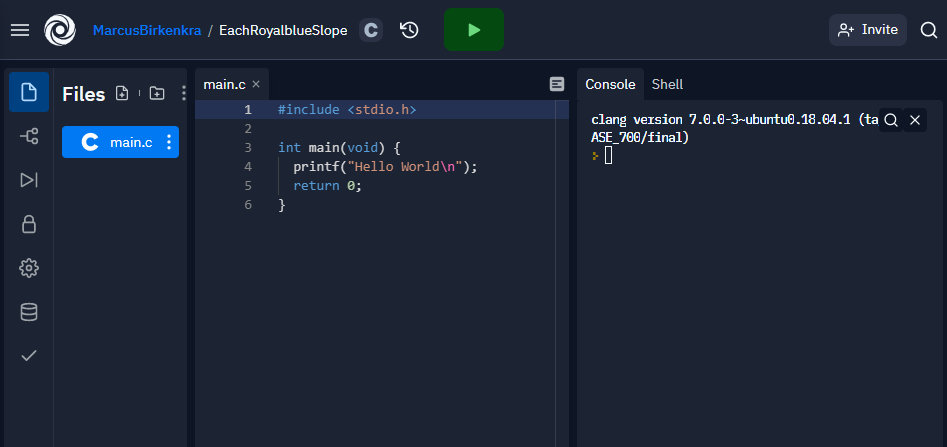
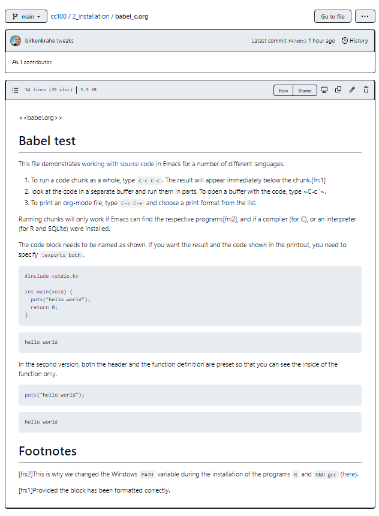

# Table of Contents

1.  [README](#org3f8d2d4)
2.  [Program structure](#org873bc34)
3.  [Hello world program](#org369b8a3)
4.  ["What a Tangled Web We Weave&#x2026;"](#org328f769)
5.  [Hello World Version 1](#org8fceda1)
6.  [Hello World Version 2](#org6fd0e74)
7.  [Hello World Version 3](#org5d7bb8a)
8.  [Compiler workflow](#orgeb96648)
9.  [Shell execution](#org4135e93)
10. [Syntax highlighting in Emacs](#org88f1ad1)
11. [Comments](#org86943c1)
12. [Let's practice!](#org00d3291)
13. [Summary](#org713318a)
14. [Code summary](#org42c5d69)
15. [Glossary](#org901297a)
16. [References](#org9442bd6)

# README

-   This script summarizes and adds to the treatment by King (2008),
    chapter 2, C Fundamentals - see also [slides (GDrive)](https://docs.google.com/presentation/d/14qvh00aVb_R09_hrQY0EDEK_JLAkgZ0S/edit?usp=sharing&ouid=102963037093118135110&rtpof=true&sd=true).

-   There is a separate Org-mode file available for practice. Download
    `2_hello_practice.org` from GitHub: [tinyurl.com/yckuhh2f](https://tinyurl.com/yckuhh2f)

-   Open a command line terminal and change (`cd`) to the Downloads
    directory

-   Open the file in Emacs with `emacs -nw --file 2_hello_practice.org`

-   When you leave class without having completed the file, save a
    copy to GDrive as a backup and/or to work on it from home

-   When you've completed the file, upload it to Canvas where you'll
    find a "Class practice" assignment named `2_hello_practice.org`.

# Program structure

")

-   All C program statements must be included in a `main` function

-   The `main` function has a body delimited by `{...}`

-   There can be *pre-processor* *directives* - `#include` or `#define`.

# Hello world program

# "What a Tangled Web We Weave&#x2026;"

> "Oh, what a tangled web we weave, when first we practice to deceive!"
> (Sir Walter Scott, 1808)

In this section, we're once again running code blocks from within
Org-mode - with a few new *literate programming* features:

-   To distinguish (and reference) code blocks, we will name them
    (`#+NAME:`). The name can can then be referenced anywhere

-   To turn the code block into a source code C file (`.c`), we will
    add a `:tangle FILENAME` statement to the header

-   To create the tangled (source code) file from a block, use the keys
    `C-c C-v t` (`org-babel-tangle`)<a id="fnr.1" class="footref" href="#fn.1" role="doc-backlink">1</a>

-   To create the tangled (source code) from a file (all blocks), use
    the keys `C-c C-v f` (`org-babel-tangle-file`)

-   Since source code files should have comments, we add the header
    argument `:comments both`: now, the most recent org block is used as a
    comment

-   The workflow of "tangling" and "weaving"<a id="fnr.2" class="footref" href="#fn.2" role="doc-backlink">2</a> looks like this:
    
    
    
    [Learn more about extracting source code from Org files.](https://orgmode.org/manual/Extracting-Source-Code.html)

# Hello World Version 1

    #include <stdio.h>
    int main(void)
    {
      printf("Hello world\n");
      return 0;
    }

    Hello world

What happens in [1](#org332f458):

-   A *header* file (`stdio.h`) is included for input/output
-   A *function* (`main`) without arguments (`void`) is defined
-   The function returns *integer* data (`int`)
-   A *string* (`"..."`) is printed out
-   A *new-line* is added at the end (`\n`)
-   If successful, the program *returns* the value `0`

# Hello World Version 2

The program could also have been written much simpler:

-   In [2](#orgd9983d6),the function `main` is missing the `void` argument, and the
    `int` (indicating the type of variable returned - an integer).
    
        #include <stdio.h>
        main()
        {
          printf("Hello world\n");
        }
    
        Hello world

-   It is the job of the *compiler*, `gcc`, which acts behind the scenes as
    it were, to resolve issues like "missing `int`" or "missing `return`"

-   If you *tangle* [2](#orgd9983d6) and compile the source file `hello2.c` in a
    shell, you get a warning:
    
        $ gcc hello2.c
          hello2.c:2:1: warning: return type defaults to 'int' [-Wimplicit-int]
          main()
          ^~~~

# Hello World Version 3

The program could also have been written more complicated:

-   `int argc` is an integer, or single number - the number of arguments
    that were passed to `main`
-   `char **argv` (or `char *argv[]`) is a *pointer* that refers to an *array*
    of characters - a more complicated data structure

    #include <stdio.h>
    
    int main(int argc, char **argv)
    {
      printf("hello world\n");
      return 0;
    }

    hello world

# Compiler workflow

The machine cannot process a C source file like `hello.c` without
help. It must:

<table id="org2d20f98" border="2" cellspacing="0" cellpadding="6" rules="groups" frame="hsides">

<colgroup>
<col  class="org-left" />

<col  class="org-left" />
</colgroup>
<thead>
<tr>
<th scope="col" class="org-left"><i>Preprocess</i></th>
<th scope="col" class="org-left">The preprocessor acts on lines beginning with <code>#</code></th>
</tr>
</thead>

<tbody>
<tr>
<td class="org-left"><i>Compile</i></td>
<td class="org-left">The compiler translates instructions into object code</td>
</tr>
</tbody>

<tbody>
<tr>
<td class="org-left"><i>Link</i></td>
<td class="org-left">The linker combines object code and functions like <code>printf()</code></td>
</tr>
</tbody>

<tbody>
<tr>
<td class="org-left"><i>Run</i></td>
<td class="org-left">The final <code>*.exe</code> program is a binary (machine) program</td>
</tr>
</tbody>

<tbody>
<tr>
<td class="org-left"><i>Debug</i></td>
<td class="org-left">The debugger controls rule violations along the way</td>
</tr>
</tbody>
</table>

I compiled the `hello.c` program on a Linux box - the executable is
called `hello.out`. The other binary is `hello.exe` compiled on
Windows. Compare the two executables - what do you notice?

**Question: are these executables portable?**<a id="fnr.3" class="footref" href="#fn.3" role="doc-backlink">3</a>

# Shell execution

-   You can also save the code in a C source code file `hello.c`

-   Instead of Emacs, you could use `notepad` on Windows or `nano` on Linux

-   You can compile the source files on the command line terminal or in
    the Emacs shell. Here is the workflow:

<table id="org108023d" border="2" cellspacing="0" cellpadding="6" rules="groups" frame="hsides">

<colgroup>
<col  class="org-left" />

<col  class="org-left" />
</colgroup>
<thead>
<tr>
<th scope="col" class="org-left">COMMAND</th>
<th scope="col" class="org-left">ACTION</th>
</tr>
</thead>

<tbody>
<tr>
<td class="org-left"><code>C-x C-f hello.c</code></td>
<td class="org-left">Create C file <code>hello.c</code></td>
</tr>

<tr>
<td class="org-left">&#xa0;</td>
<td class="org-left">Copy block or write code anew in <code>hello.c</code></td>
</tr>

<tr>
<td class="org-left"><code>C-x C-s</code></td>
<td class="org-left">Save <code>hello.c</code></td>
</tr>

<tr>
<td class="org-left"><code>M-x eshell</code></td>
<td class="org-left">start a Linux shell in an Emacs buffer</td>
</tr>

<tr>
<td class="org-left"><code>gcc hello.c -o hello</code></td>
<td class="org-left">compile program and create executable</td>
</tr>

<tr>
<td class="org-left"><code>ls -l hello*</code></td>
<td class="org-left">list files - you should see <code>hello</code>, <code>hello.c</code></td>
</tr>

<tr>
<td class="org-left"><code>/.hello</code></td>
<td class="org-left">execute program</td>
</tr>
</tbody>
</table>

-   The *eshell* is an Emacs Lisp simulation of a Linux shell (`bash`)

-   On Windows, `PowerShell` works as well as the CMD shell: 
    
    

# Syntax highlighting in Emacs

-   Notice the slight syntax highlighting difference to an online REPL
    `repl.it`<a id="fnr.4" class="footref" href="#fn.4" role="doc-backlink">4</a>:
    
    
    
    

-   There is no highlighting standard - you should experiment with
    different themes<a id="fnr.5" class="footref" href="#fn.5" role="doc-backlink">5</a>

-   Display line numbers with `display-line-numbers-mode`, and highlight
    lines with `hl-line-mode`<a id="fnr.6" class="footref" href="#fn.6" role="doc-backlink">6</a> - you can toggle these, and you can
    go through the minibuffer history with `M-x M-p` and `M-n`:
    
    

# Comments

Forgetting to terminate a *comment* may cause the compiler to ignore
part of your program - but both syntax highlighting and auto-indent
in the editor will tip you off:

    
    printf("My "); /* forgot to close this comment ...
    		  printf("cat ");
    		  printf("has ");  /* so it ends here */
    printf("fleas");

    My fleas

Let's fix this:

    
    printf("My "); /* forgot to close this comment */
    printf("cat ");
    printf("has ");  /* so it ends here */
    printf("fleas");

    My cat has fleas

# Let's practice!

Go to the [Org-mode practice file](https://tinyurl.com/yckuhh2f) and complete the first few exercises:

1.  understand and change syntax highlighting
2.  understanding and using comments in C
    
    

# Summary

-   C programs must be compiled and linked
-   Programs consist of directives, functions, and statements
-   C directives begin with a hash mark (`#`)
-   C statements end with a semicolon (`;`)
-   C functions begin and end with parentheses `{` and `}`
-   C programs should be readable
-   Input and output has to be formatted correctly

# Code summary

<table border="2" cellspacing="0" cellpadding="6" rules="groups" frame="hsides">

<colgroup>
<col  class="org-left" />

<col  class="org-left" />
</colgroup>
<thead>
<tr>
<th scope="col" class="org-left">CODE</th>
<th scope="col" class="org-left">EXPLANATION</th>
</tr>
</thead>

<tbody>
<tr>
<td class="org-left"><code>#include</code></td>
<td class="org-left">directive to include other programs</td>
</tr>

<tr>
<td class="org-left"><code>stdio.h</code></td>
<td class="org-left">standard input/output header file</td>
</tr>

<tr>
<td class="org-left"><code>main(int argc, char **argv)</code></td>
<td class="org-left">main function with two arguments</td>
</tr>

<tr>
<td class="org-left"><code>return</code></td>
<td class="org-left">statement (successful completion)</td>
</tr>

<tr>
<td class="org-left"><code>void</code></td>
<td class="org-left">empty argument - no value</td>
</tr>

<tr>
<td class="org-left"><code>printf</code></td>
<td class="org-left">printing function</td>
</tr>

<tr>
<td class="org-left"><code>\n</code></td>
<td class="org-left">escape character (new-line)</td>
</tr>

<tr>
<td class="org-left"><code>/* ... */</code>  <code>//...</code></td>
<td class="org-left">comments</td>
</tr>

<tr>
<td class="org-left"><code>scanf</code></td>
<td class="org-left">input pattern function</td>
</tr>

<tr>
<td class="org-left"><code>main(void)</code></td>
<td class="org-left">main function without argument</td>
</tr>
</tbody>
</table>

# Glossary

<table border="2" cellspacing="0" cellpadding="6" rules="groups" frame="hsides">

<colgroup>
<col  class="org-left" />

<col  class="org-left" />
</colgroup>
<thead>
<tr>
<th scope="col" class="org-left">CONCEPT</th>
<th scope="col" class="org-left">EXPLANATION</th>
</tr>
</thead>

<tbody>
<tr>
<td class="org-left">Compiler</td>
<td class="org-left">translates source code to object code</td>
</tr>

<tr>
<td class="org-left">Linker</td>
<td class="org-left">translates object code to machine code</td>
</tr>

<tr>
<td class="org-left">Syntax</td>
<td class="org-left">language rules</td>
</tr>

<tr>
<td class="org-left">Debugger</td>
<td class="org-left">checks syntax</td>
</tr>

<tr>
<td class="org-left">Directive</td>
<td class="org-left">starts with <code>#</code>, one line only, no delimiter</td>
</tr>

<tr>
<td class="org-left">Preprocessor</td>
<td class="org-left">processes directives</td>
</tr>

<tr>
<td class="org-left">Statement</td>
<td class="org-left">command to be executed, e.g. <code>return</code></td>
</tr>

<tr>
<td class="org-left">Delimiter</td>
<td class="org-left">ends a statement (in C: semicolon - ;)</td>
</tr>

<tr>
<td class="org-left">Function</td>
<td class="org-left">a rule to compute something with arguments</td>
</tr>

<tr>
<td class="org-left">String</td>
<td class="org-left">Sequence of <i>character</i> values like <code>hello</code></td>
</tr>

<tr>
<td class="org-left">String literal</td>
<td class="org-left">Unchangeable, like the numbe <code>8</code> or the string <code>hello</code></td>
</tr>

<tr>
<td class="org-left">Constant</td>
<td class="org-left">Set value that is not changed</td>
</tr>

<tr>
<td class="org-left">Variable</td>
<td class="org-left">A named memory placeholder for a value, e.g. <code>int i</code></td>
</tr>

<tr>
<td class="org-left">Data type</td>
<td class="org-left">A memory storage instruction like <code>int</code> for integer</td>
</tr>

<tr>
<td class="org-left">Comment</td>
<td class="org-left">Region of code that is not executed</td>
</tr>

<tr>
<td class="org-left">Format specifier</td>
<td class="org-left">Formatting symbol like <code>%d%</code> or <code>%f%</code></td>
</tr>

<tr>
<td class="org-left">Data type</td>
<td class="org-left">Tells the computer to reserve memory,</td>
</tr>

<tr>
<td class="org-left">&#xa0;</td>
<td class="org-left">e.g. <code>int</code> for integer numbers</td>
</tr>

<tr>
<td class="org-left">Type declaration</td>
<td class="org-left">Combination of type and variable name - e.g. <code>int height;</code></td>
</tr>

<tr>
<td class="org-left"><code>int</code></td>
<td class="org-left">C type for integer numbers, e.g. 2</td>
</tr>

<tr>
<td class="org-left"><code>float</code></td>
<td class="org-left">C type for floating point numbers, e.g. 3.14</td>
</tr>

<tr>
<td class="org-left"><code>char</code></td>
<td class="org-left">C type for characters, like "joey"</td>
</tr>

<tr>
<td class="org-left">Formatting</td>
<td class="org-left">Tells the computer how to print, e.g. <code>%d</code> for <code>int</code> types</td>
</tr>

<tr>
<td class="org-left"><code>%d</code></td>
<td class="org-left">Format for integers</td>
</tr>

<tr>
<td class="org-left"><code>%f</code> and <code>%.pf</code></td>
<td class="org-left">Format for floating point numbers</td>
</tr>

<tr>
<td class="org-left">&#xa0;</td>
<td class="org-left">(with <code>p</code> digits after the point)</td>
</tr>

<tr>
<td class="org-left"><code>#define</code></td>
<td class="org-left">Define a constant with the preprocessor,</td>
</tr>

<tr>
<td class="org-left">&#xa0;</td>
<td class="org-left">e.g. <code>#define PI 3.14</code></td>
</tr>

<tr>
<td class="org-left"><code>math.h</code></td>
<td class="org-left">Math library, contains mathematical constants &amp; functions</td>
</tr>

<tr>
<td class="org-left"><code>stdio.h</code></td>
<td class="org-left">Input/Output library, enables <code>printf</code> and <code>scanf</code></td>
</tr>

<tr>
<td class="org-left"><code>const</code></td>
<td class="org-left">Constant identifier, e.g. <code>const double PI = 3.14;</code></td>
</tr>
</tbody>
</table>

# References

-   Collingbourne (2019). The Little Book of C (Rev. 1.2). Dark Neon.
-   King (2008). C Programming - A Modern Approach. Norton. [Online:
    knking.com](http://knking.com/books/c2/index.html).

# Footnotes

<a id="fn.1" href="#fnr.1">1</a> To tangle only the currently selected block, use
`org-babel-tangle` with a prefix argument: `C-u C-c C-v t` or `C-u M-x
  org-bable-tangle`.

<a id="fn.2" href="#fnr.2">2</a> In our case, instead of weaving TeX files (`.tex`) to print, we
weave Markdown files (`.md`), or WORD (`*.odt`) files, or we dispense with
the weaving altogether because Org-mode files (equivalent of the `*.w`
or "web" files) look fine on GitHub.  GitHub.

<a id="fn.3" href="#fnr.3">3</a> Executables are the result of compilation for a specific
computer architecture and OS. The `.exe` program was compiled for
Windows, the `.out` program was compiled for Linux. They will only run
on these OS.

<a id="fn.4" href="#fnr.4">4</a> [replit.com](https://replit.com) is an online Read-Eval-Print-Loop (REPL) that looks
like a Linux installation (in fact, it is a so-called Docker
container, an emulated, customized Linux installation). When
registering (for free) you can use many different programming
languages - here is a [link to my container](https://replit.com/@birkenkrahe/DiscreteDearObjectdatabase#main.c).

<a id="fn.5" href="#fnr.5">5</a> You can find different [themes for GNU Emacs](https://emacsthemes.com/) here, and install
them using `M-x package-list-packages`. To see the differences, enter
`M-x custom-themes` and pick another theme now. You can save it
automatically for future sessions.

<a id="fn.6" href="#fnr.6">6</a> If you always want to have line numbers and highlight the line
under the cursor, put these lines in your `.emacs` file: and restart
Emacs:

    ;; always display line numbers
    (global-display-line-numbers-mode)
    ;; enable global highlighting
    (global-hl-line-mode 1)
