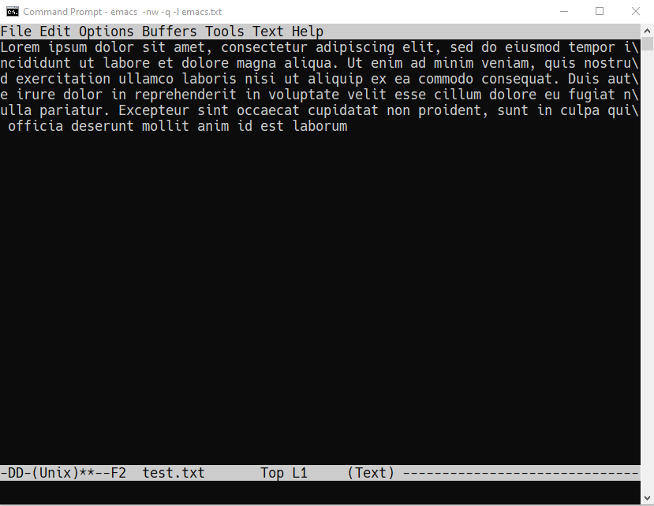

# Table of Contents

1.  [The mode line - basic buffer movement](#org5f34f65)

# The mode line - basic buffer movement

1.  Open a new file with `C-x C-f`. At the prompt, enter the file name:
    `tutor.txt`.

2.  Alternatively, you can also open the file directly from
    the command line: `emacs --file tutor.txt`.

3.  The modeline shows (among other things):
    -   A few dashes to indicate the edit status (`----`)
    -   A file name (`text.txt`)
    -   How far down in the file you've come (`All` because it's empty)
    -   The line number your cursor is on (e.g. `L1`)
    -   The file mode (`Text`)

4.  Open a browser, open at [tinyurl.com/22rt7t2f](https://tinyurl.com/22rt7t2f) and save the file
    (with a mouse right-click) as `text.txt` in your downloads
    directory - `c:/User/yourname/Downloads`.

5.  In `tutor.txt`, enter `C-x i` and insert the file `text.txt` from its
    location, `Downloads`. If you mess up (at any time), type `C-g` to
    quit any command sequence:
    
    

6.  The mode line now indicates that the file has been changed: `**--`

7.  Save the file with `C-x C-s`. You should get a confirmation in the
    minibuffer, alongside the full path to the file, e.g.
    
        Wrote c:/Users/birkenkrahe/tutor.txt

8.  The text is saved as one long line. Go to the start of the line
    with `C-a`, then to the end with `C-e`.

9.  Go back on the line with `C-b`, and forward with `C-f` (one character),
    or with `M-b` and `M-f` (one word).

10. Type `M-x column <TAB> <RET>` (that's `ALT` + `column` + `Tab-key` +
    `Enter`). The command completes to `M-x column-number-mode`. In the
    mode line, you will now see both row and column number of the
    cursor position.

11. This last command "toggles", which means that you can switch it
    on/off by repeating the command. Try that a couple of times.

